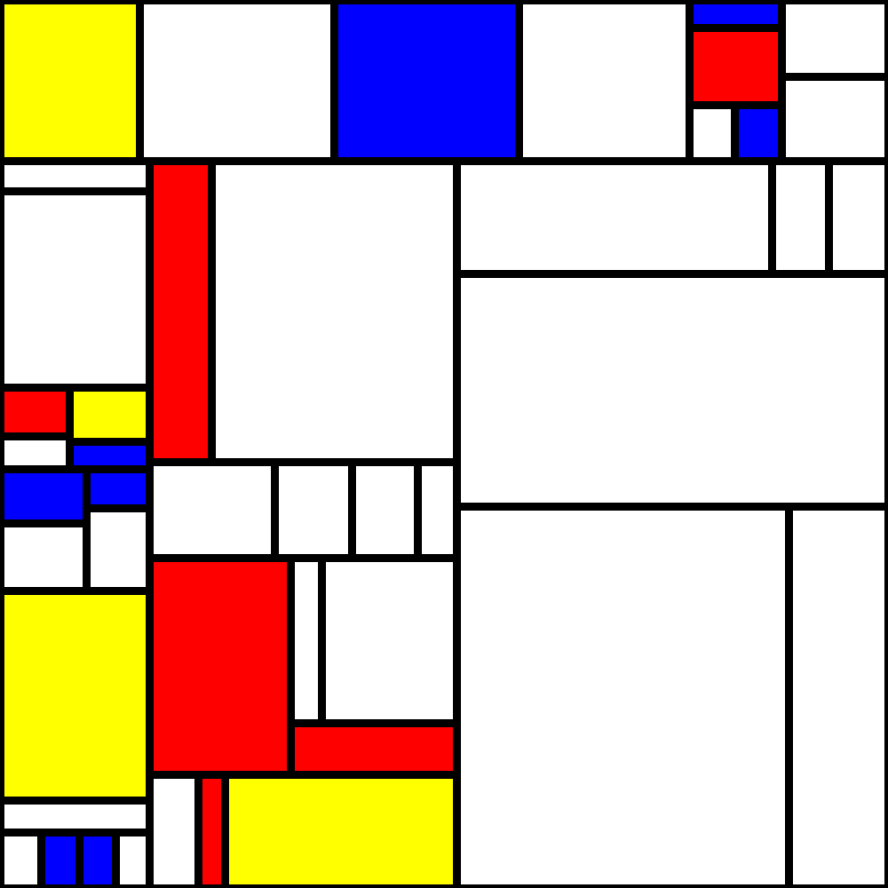

# MondorianMaker

MondorianMakerは、幾何学的な形状と原色を使用してモンドリアン風の抽象芸術を生成するPythonスクリプトです。

## 概要

このスクリプトは、長方形を再帰的に分割し彩色することで、モンドリアン風の画像を作成します。画像の描画と保存にはPython Imaging Library (PIL)を使用しています。

## 特徴
- 複数のモンドリアン風画像を生成
- キャンバスサイズと反復回数のカスタマイズが可能
- 生成された画像は反復回数に基づいて名付けられた新しいフォルダに保存

## 必要条件

- Python 3.x
- Pillow (PIL Fork)
- NumPy

## インストール

1. Python 3.xがシステムにインストールされていることを確認してください。
2. 必要なライブラリをインストールします：

```
pip install Pillow numpy
```

## 使用方法

1. スクリプトを実行します：

```
python MondorianMaker.py
```

2. スクリプトは`ite=60`（または設定した反復回数）という名前の新しいフォルダを同じディレクトリに作成します。
3. 30枚のモンドリアン風画像を生成し、新しいフォルダにPNGファイルとして保存します。

## カスタマイズ

スクリプト内で以下のパラメータを変更できます：

- `width, height`：キャンバスサイズを変更（デフォルトは1000x1000）
- `iterations`：長方形の分割回数を調整（デフォルトは60）
- `side_min`：長方形の最小辺長を変更（デフォルトは60）
- `colors`：色のリストに追加または削除

## 動作原理

1. スクリプトは、キャンバス全体を表す1つの長方形から開始します。
2. ランダムに選択した長方形を縦または横に分割する処理を繰り返します。
3. 分割後、一部の長方形をランダムに原色（赤、青、黄）で彩色します。
4. すべての長方形の間に黒い線を引き、特徴的なモンドリアン風のスタイルを作り出します。

## ライセンス

このプロジェクトはオープンソースで、MITライセンスの下で利用可能です。

## 貢献

貢献、問題提起、機能リクエストを歓迎します。貢献したい場合は、issuesページをご確認ください。

## 作者

Kamiya Hiroki

## 謝辞

このプロジェクトは、オランダの画家で抽象芸術の先駆者であるピエト・モンドリアンの作品にインスピレーションを得ています。

